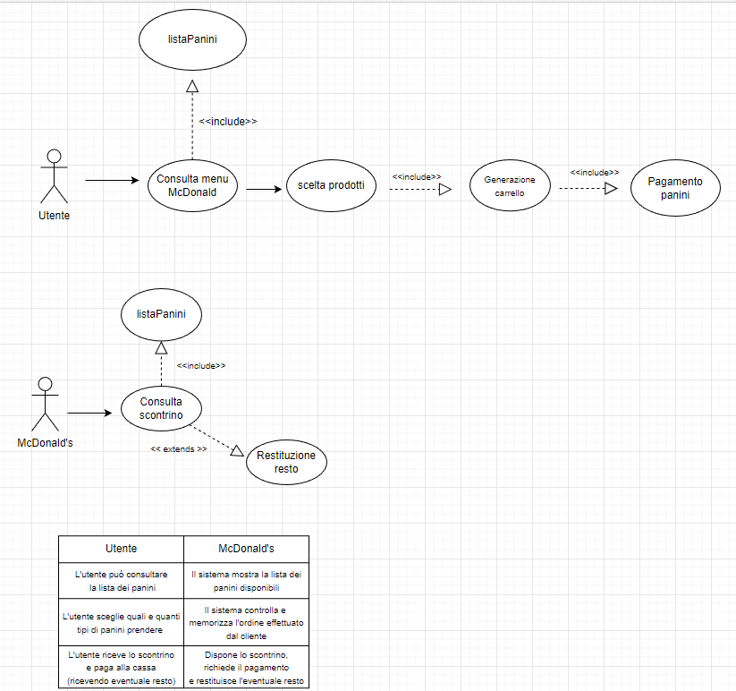
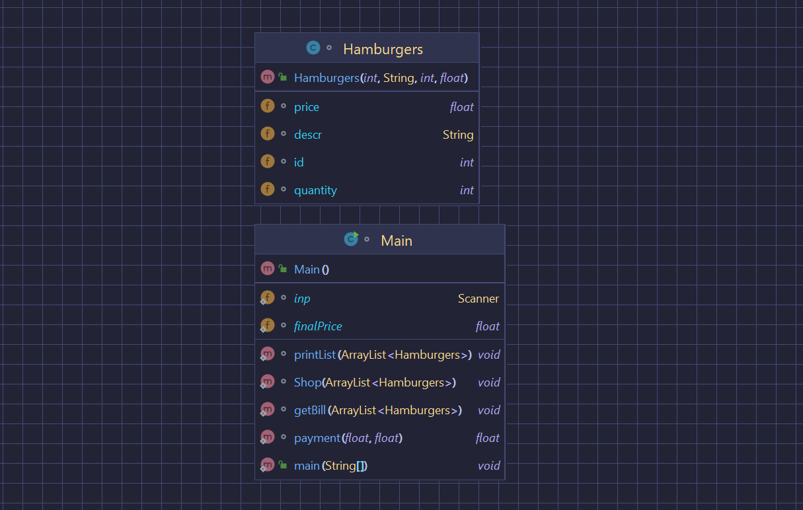

Casi d'uso:

    <a>
        
    </a>

Classi:

    <a>
        
    </a>

Analisi:

Il programma simula il funzionamento di un totem del ristorante Mcdonald's, mettendo a disposizione una lista di prodotti che vengono venduti ai clienti.
Un utente ha la possibilità di scegliere ogni prodotto che desidera, finchè il prodotto non sia esaurito. In quel caso verrà mostrato un errore.
L'utente alla fine potrà visualizzare lo scontrino con tutti i prodotti che aveva aggiunto e successivamente pagare alla cassa e avere il suo resto (se il resto è maggiore di 0).